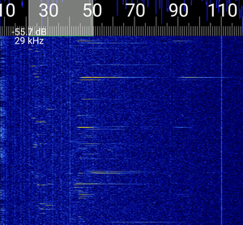
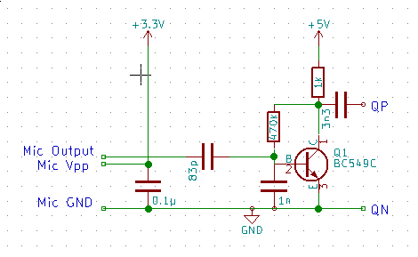
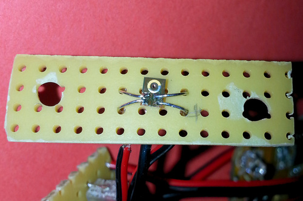
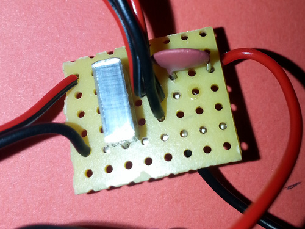
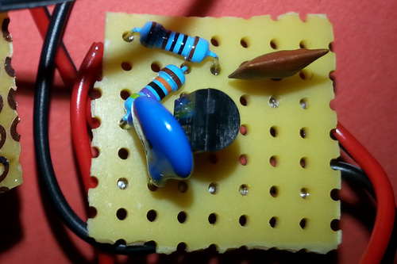
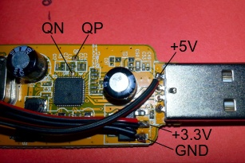
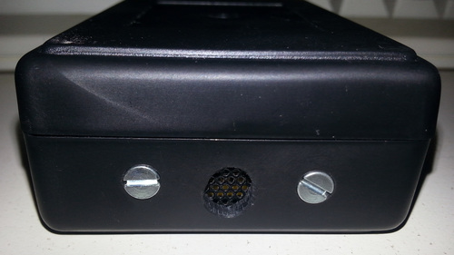
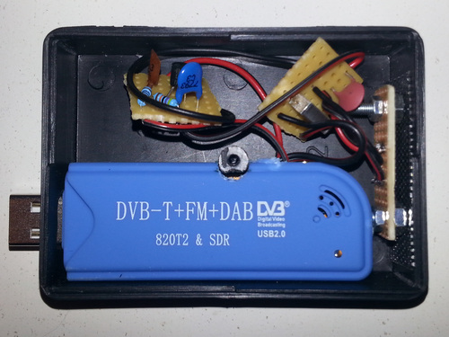

# BatSDR
## Introduction
As bat detectors featuring a graphical display are quite expensive but RTL-SDR dongles are very cheap (~11 euros on ebay/amazon), I wanted to make a bat detector based on the generic chinese RTL-SDR dongle with the R820T2 tuner.
The idea was to use audio from a microphone or ultrasonic receiver, amplify it and to feed it to a RTL SDR in direct sampling mode. The bat noises can be watched on the waterfall and made audible using high bandwidth SSB or AM demodulation of SDR software like gqrx.

For mobile usage, there is a [version of RFAnalyzer](https://github.com/jbvoelker/RFAnalyzer/tree/afgain) with support for direct sampling mode, manual af gain and increased bandwith in SSB and AM. With this version or RFAnalyzer, USB demodulation is recommended.

The following screenshot has been taken while observing bats hunting over a lake surrounded by blossoming chestnut trees.

## The circuit

### The Microphone
The microphone used in this project is a Knowles SPH0611LR5H-1 MEMS microphone which is intended for audio usage but offers a decent sensibility in the ultrasonic range.
It is quite small in size (3.5mm x 2.65mm) and the four contact pads are not easy to solder. As the hole of the microphone is located on the solder side, I connected it dead bug style to a perf board. To hold it while soldering, I stuck the microphone on the table using double sided adhesive tape.

The microphone needs a voltage of 1.5V-3.6V to operate. The RTL-SDR has a regulator which generates 3.3V from the 5V USB power.
Two cables can be soldered to the regulator and to Vpp and GND of the microphone. A 0.1µF capacitor between Vpp and GND is recommended.
I have placed the coupling capacitor for the microphone on the same perf board as the capacitor to create a unit which can be easily swapped when I change the microphone. During experimentation, a capacitor of 83pF did the best job in suppressing low frequencies (feedback when demodulating or talking near the receiver) and letting the ultrasonic signals pass.

If you are unable to obtain the microphone or don't dare soldering it, a simple 40 KHz ultrasonic receiver can be used instead. It must be connected directly to the preamp and offers less sensitivity above and below the resonance peak as well as a strange amplitude frequency response.

I have not done any experiments with a dedicated ultrasonic microphone which is also offered by the same manufacturer as they are hard to obtain if you don't want to spend ~ 20 euros on shipping costs.

### The preamp circuit
The preamp is based on a single BC549C transistor. The 1nF capacitor between B and E suppresses high frequency signals, the 3.3nF coupling capacitor should prevent any low frequency signals which have been picked up and amplified to get to the RTL-SDR. The terminals marked QN and QP in the circuit diagram go directly to the two soldering pads marked in the image below.

## Modifications to the dongle
The generic chinese dongle features two holes with lands on the solder side which are marked QP and QN. These connections are used to feed a signal to the dongle which can be received in the direct sampling mode (direct_samp=2 in the device string).
The +5V for the preamp circuit are taken from the 5V USB line, GND and 3.3V are taken from the regulator.

As soldering wires directly to the QN and QP terminals bypasses static protection, be careful with static discharge or you could kill the dongle (while soldering, I had a cat on my lap and the dongle still works, so they are probably not too easy to destroy).

## Result
The bat detector can be mounted in a plastic housing. A size of 84mm x 59.5mm x 30mm is perfect to accomodate the dongle and the preamp circuit.
The microphone board is mounted to the front of the case using two screws.
A piece of speaker grille can be added to protect the interior from larger particles.

